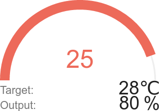

# HotSpot

HotSpot is an ESP8266 powered hotplate designed for use in small reflow operations.

## Software Installation

1. Download/Clone repository
2. Extract if nessesary
3. Open hotspot.html using Google Chrome, FireFox or Microsoft Edge

## Software Usage

The hotspot user interface is written in html, javascript and css. If those sound familiar, they should. These are the langudges that make up the web, and you already have the viewing installed. The UI runs in any modern browser and communicates with the hotspot via wifi.

Screenshot:

### Controls

#### On Button
The on button starts the reflow process. Make sure your board is in position, because there is no delay before the initial ramp.

#### Off Button
The off button stops any current reflow proccess.

#### Set Button
The set button can be used to set hotspot to a specific temperature for an unlimited amount of time.

#### Temperature Graph
The temperature graphs displays the measured temperature in relation to time (in milliseconds).

#### Hamburger button

The hamburger button can be clicked to export the temperature graph to a png or jpg image

#### Information Arena

The information arena contains information about HotSpot's current status.
The Output and Input are indicated along with a graphical representation of the setpoint vs the current point. The target temperature can be directly edited just like a normal textbox.

#### Status Bar
The status bar is a graphical representation of the progress of a currently running reflow process.
The label under the bar indicates the current stage in conjunction with the color and position of the bar.
